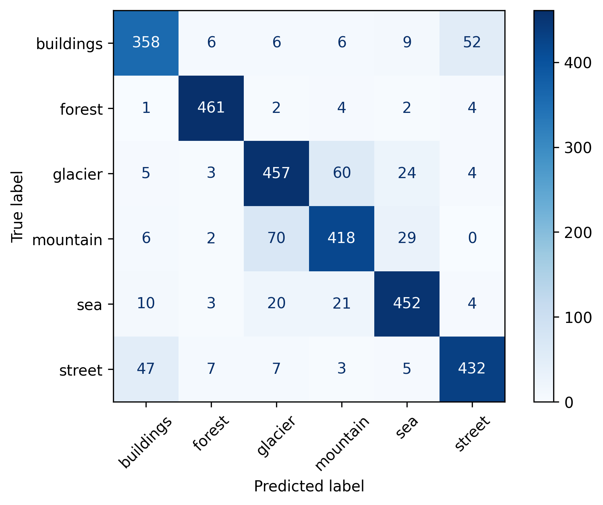
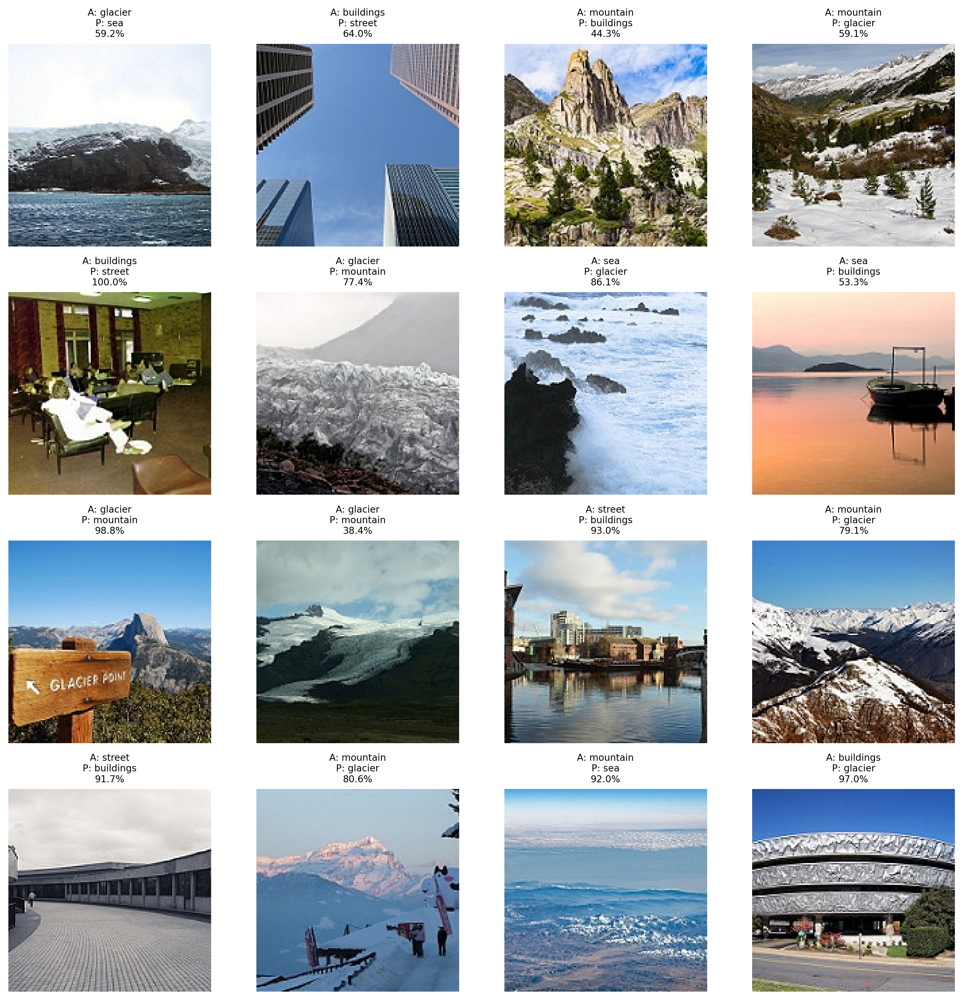

# 🏞️ SceneVision-AI

A deep learning project for natural scene image classification using a custom Convolutional Neural Network (CNN) built with PyTorch.

## Project Overview

SceneVision-AI is an end-to-end computer vision project that classifies natural scene images into six categories using a custom CNN.

The project demonstrates the complete deep learning workflow, including:

- Dataset preparation
- Model training
- Validation
- Evaluation
- Prediction
- Performance visualization
- Feature map analysis
- Misclassified image analysis

The project was built as a professional portfolio project following machine learning engineering best practices.

## Features

- Custom CNN architecture
- GPU (CUDA) training
- Early Stopping
- Learning Rate Scheduler
- Model Checkpointing
- Single Image Prediction
- Confusion Matrix
- Training Curves
- Feature Map Visualization
- Misclassified Image Analysis

## Dataset

Dataset: Intel Image Classification Dataset

Classes:

- Buildings
- Forest
- Glacier
- Mountain
- Sea
- Street

Image Size: 150 × 150 RGB

### Project Structure
SceneVision-AI
│
├── assets/
├── data/
├── outputs/
├── src/
│   ├── model/cnn.py
│   ├── dataset.py
│   ├── train.py
│   ├── evaluate.py
│   ├── predict.py
│   └── visualize.py
│
├── requirements.txt
└── README.md

## Model Architecture

The baseline model consists of:

- 3 Convolution Blocks
- Batch Normalization
- ReLU Activation
- Max Pooling
- Fully Connected Classifier
- Dropout (0.5)

Loss Function:
- CrossEntropyLoss

Optimizer:
- Adam

Learning Rate Scheduler:
- ReduceLROnPlateau

## Tech Stack

- Python
- PyTorch
- TorchVision
- NumPy
- Matplotlib
- Scikit-learn
- Pillow

# Results

## 📊 Version 1 (Baseline)

### Performance

| Metric | Score |
|--------|------:|
| Train Accuracy | **93.36%** |
| Validation Accuracy | **86.96%** |
| Test Accuracy | **85.93%** |

---

### Training Configuration

- Custom CNN (3 Convolution Blocks)
- Batch Normalization
- ReLU Activation
- Max Pooling
- Adam Optimizer
- ReduceLROnPlateau Learning Rate Scheduler
- Early Stopping (Patience = 10)
- CrossEntropyLoss
- CUDA GPU Training

---

### Classification Report

| Class | Precision | Recall | F1-Score |
|--------|----------:|-------:|---------:|
| Buildings | 0.84 | 0.82 | 0.83 |
| Forest | **0.96** | **0.97** | **0.96** |
| Glacier | 0.81 | 0.83 | 0.82 |
| Mountain | 0.82 | 0.80 | 0.81 |
| Sea | 0.87 | 0.89 | 0.88 |
| Street | 0.87 | 0.86 | 0.87 |

**Overall Accuracy:** **85.93%**

### Confusion Matrix

The confusion matrix provides a detailed view of the model's predictions across all scene categories.

---

### Key Observations

- Best-performing class: **Forest** (F1-score: **0.96**)
- Most challenging classes: **Glacier** and **Mountain**
- Major confusion occurred between **Mountain ↔ Glacier**, indicating visually similar features.
- Training pipeline included checkpointing, learning-rate scheduling, and early stopping.

---

## Training Curves

The training process is visualized using loss and accuracy curves.

- Training Loss vs Validation Loss
- Training Accuracy vs Validation Accuracy

## Feature Map Visualization

The learned feature maps demonstrate how the CNN progressively extracts visual information.

- Block 1: Edge and texture detection
- Block 2: Mid-level structures and patterns
- Block 3: High-level semantic representations for classification

### Block 1

### Block 2

### Block 3

As information flows through the CNN, the learned representations become increasingly abstract.

- Block 1 extracts low-level features such as edges and textures.
- Block 2 combines these into larger visual patterns.
- Block 3 focuses on high-level semantic features that help distinguish scene categories.

## Misclassified Images

Analyzing incorrect predictions helps identify the model's weaknesses and guides future improvements.

The visualization below shows randomly selected misclassified test images along with:

- Actual class
- Predicted class
- Prediction confidence

This analysis reveals which scene categories are visually similar and where the model struggles most.

## Version History

| Version | Description |
|---------|-------------|
| v1.0 | Baseline custom CNN with complete training, evaluation, prediction, and visualization pipeline |