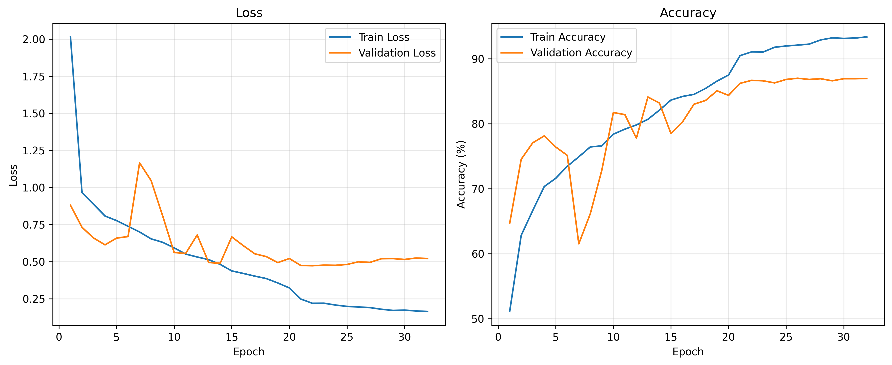
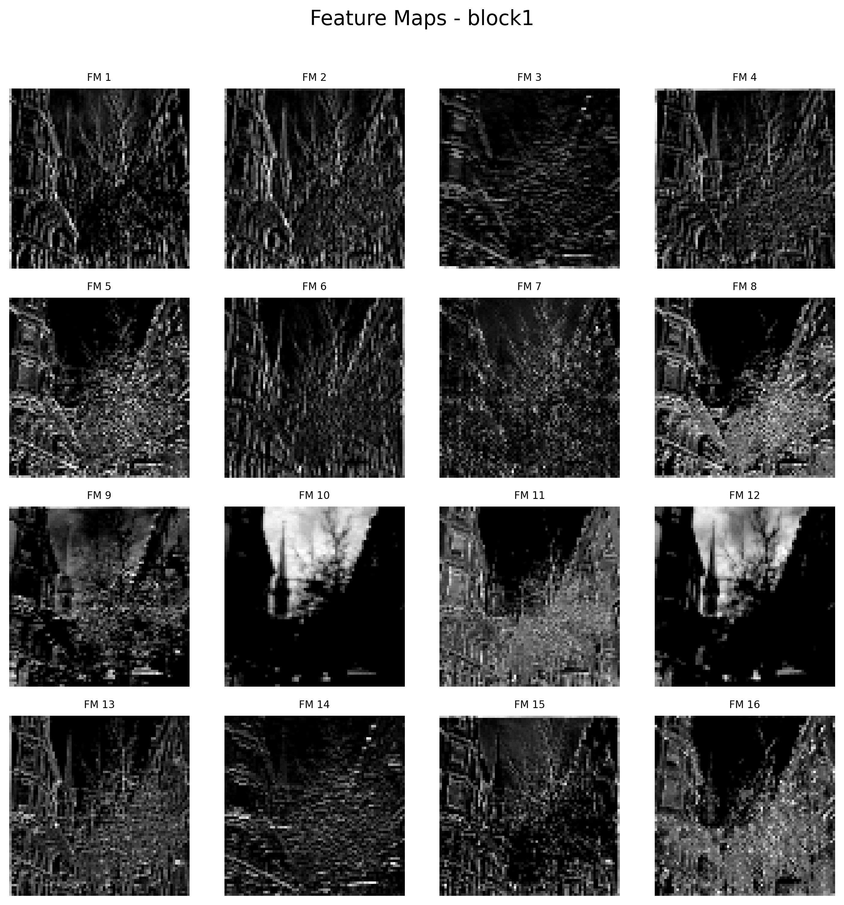
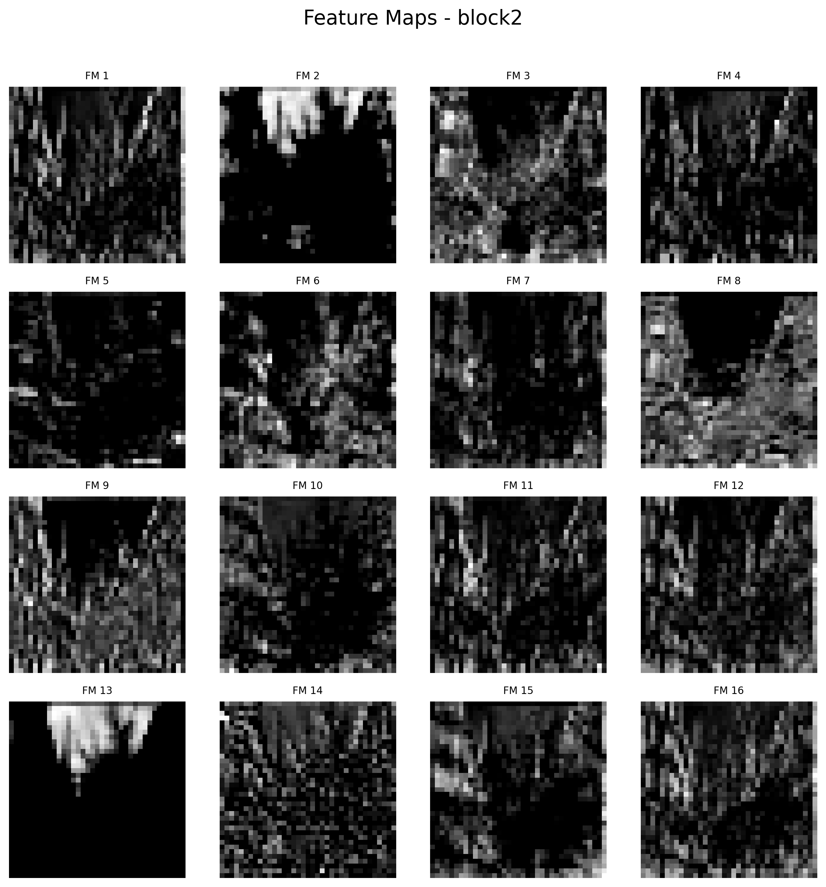
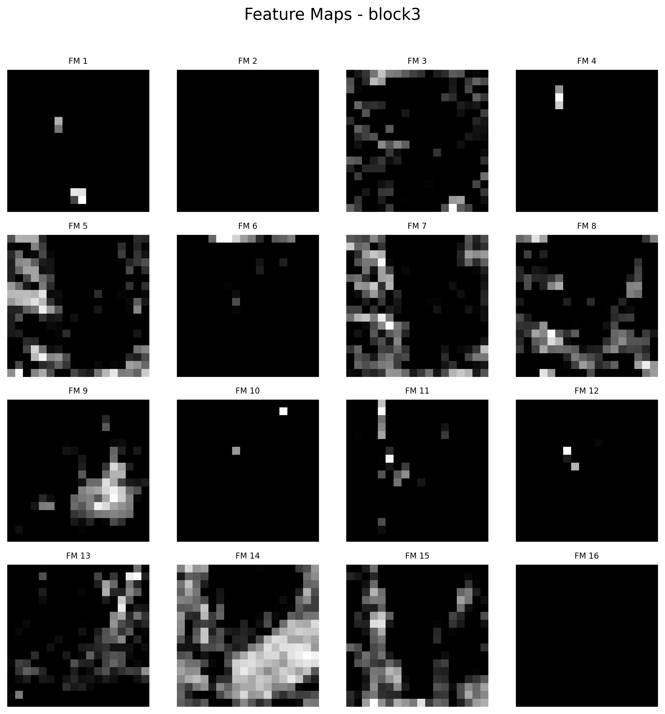

# Results

## 📊 Version 1 (Baseline)

### Performance

| Metric | Score |
|--------|------:|
| Train Accuracy | **93.36%** |
| Validation Accuracy | **86.96%** |
| Test Accuracy | **85.93%** |

---

### Model Configuration

- Custom CNN (3 Convolution Blocks)
- Batch Normalization
- ReLU Activation
- Max Pooling
- Adam Optimizer
- ReduceLROnPlateau Learning Rate Scheduler
- Early Stopping (Patience = 10)
- CrossEntropyLoss
- CUDA GPU Training

---

### Classification Report

| Class | Precision | Recall | F1-Score |
|--------|----------:|-------:|---------:|
| Buildings | 0.84 | 0.82 | 0.83 |
| Forest | **0.96** | **0.97** | **0.96** |
| Glacier | 0.81 | 0.83 | 0.82 |
| Mountain | 0.82 | 0.80 | 0.81 |
| Sea | 0.87 | 0.89 | 0.88 |
| Street | 0.87 | 0.86 | 0.87 |

**Overall Accuracy:** **85.93%**

---

### Key Observations

- Best-performing class: **Forest** (F1-score: **0.96**)
- Most challenging classes: **Glacier** and **Mountain**
- Major confusion occurred between **Mountain ↔ Glacier**, indicating visually similar features.
- Training pipeline included checkpointing, learning-rate scheduling, and early stopping.

---

## Training Curves

The training process is visualized using loss and accuracy curves.

- Training Loss vs Validation Loss
- Training Accuracy vs Validation Accuracy

## Feature Map Visualization

The learned feature maps demonstrate how the CNN progressively extracts visual information.

- Block 1: Edge and texture detection
- Block 2: Mid-level structures and patterns
- Block 3: High-level semantic representations for classification

### Block 1

### Block 2

### Block 3

As information flows through the CNN, the learned representations become increasingly abstract.

- Block 1 extracts low-level features such as edges and textures.
- Block 2 combines these into larger visual patterns.
- Block 3 focuses on high-level semantic features that help distinguish scene categories.